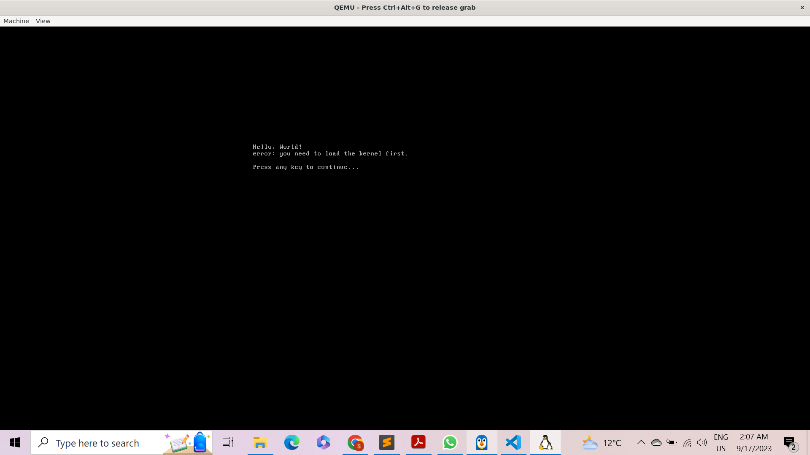

# Prequesites

## Installations
1. qemu-utils: Needed for QEMU support utilities. QEMU is a hosted virtual machine monitor that emulates the machine's processor through dynamic binary translation and provides a set of device models. In this script, qemu-system-x86_64 is used to emulate an x86_64 machine and boot from the created ISO image.

2. grub-pc-bin: Required for GRUB's installation binaries. GRUB (GRand Unified Bootloader) is a multiboot bootloader that is commonly used in Linux distributions. The script uses grub-install and grub-mkrescue commands, both of which are provided by the GRUB packages.

3. e2fsprogs: Required for the mkfs.ext2 command. This package provides utilities for ext2/ext3/ext4 file systems.

4. xorriso: Required for the grub-mkrescue command. xorriso is a utility used to create, load, manipulate, and write ISO 9660 filesystem images.

5. mtools: Also might be needed for the grub-mkrescue command.
   
## Installation Commands  

sudo apt-get update
sudo apt-get install -y qemu-utils grub-pc-bin e2fsprogs xorriso mtools

This should cover most, if not all, of the dependencies that your script would require on a fresh installation of Ubuntu 20.04 or 22.04.

# Hello World Output:

#### Error Messages

error: you need to load the kernel first

# Conclusion and Future Work

1. Fully Bootable Filesystem Image: While the current setup prints "Hello, World!", further enhancements can be made to develop a fully bootable filesystem image. This will be an advanced leap, making our lightweight Linux image more versatile and adaptable for varied use cases.

2. Pre-built Kernel Integration: As of now, the script employs the current environment's kernel. However, for standardization and improved compatibility, future implementations can explore the use of a publicly available pre-built kernel. By doing so, we can ensure consistent behavior across various systems and possibly improve the boot time.

3. C Program Execution: Instead of a simple shell script to print "Hello, World!", we can extend our scope to compile and run a C program within the Linux image to achieve the same result. This will demonstrate the system's capability to execute more complex tasks and provide a foundation for integrating additional software components.

4. Optimization and Cleanup: The script, although functional, can benefit from optimizations, both in terms of speed and resource utilization. Implementing cleanup processes post-execution, like releasing disk mounts and removing temporary files, would ensure the host system remains uncluttered.

5. User-Friendly Enhancements: To improve user experience, we could implement logging mechanisms that provide real-time feedback during the creation and booting processes. Additionally, implementing error handling and recovery mechanisms would make the script more resilient.

While the current script effectively meets the basic requirements set out in the problem statement, there is ample room for expansion and enhancement